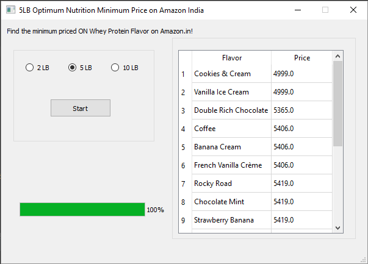

# Minimal_Price_Finder_5LB_Whey_ON

So, I order a pack of Optimum Nutrition 5LB WHEY Protein every few months. I thought it would be a fun exercise to write a python web scraping script to determine the lowest priced flavor in the same variant. Event better, I'll arrange them in a non-decreasing dictionary in order of their price list! (Since some of us have a flavor over price preference in their protein shakes!)
  
I may choose to enable 10LB option as well, but that completely depends on my need of that feature.
(I mostly buy the 5 pounds pack)

Here's a screenshot from the working version of the app:  
  
  

